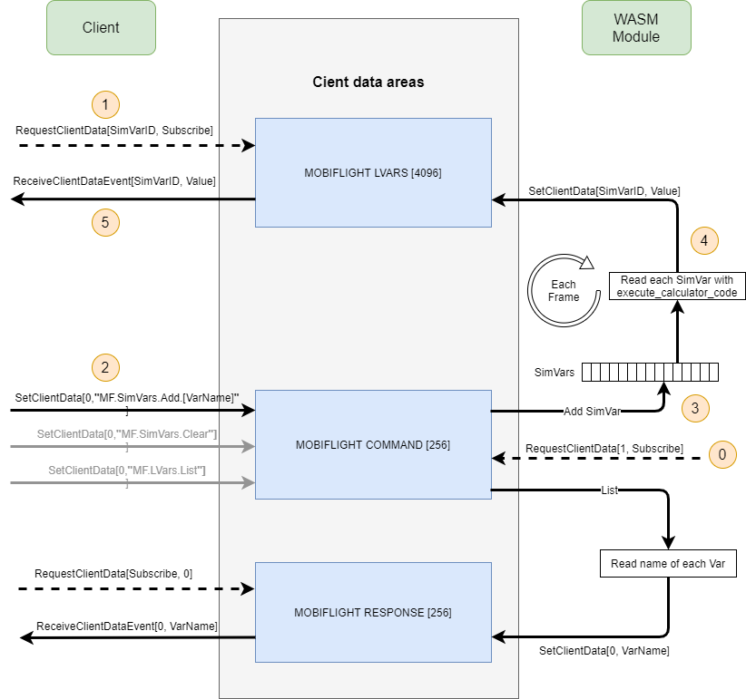

# MSFS Python SimConnect MobiFlight Extension
Extends the [python simconnect library](https://github.com/odwdinc/Python-SimConnect) for MSFS2020 with the capability to read A and L variables with help of the [MobiFlight](https://www.mobiflight.com) WASM module.

To just execute Mobiflight SimConnect Events this extension is NOT necessary. This can already be done with the Python-SimConnect library.

* ```SimConnectMobiFlight``` inherits from ```SimConnect```, fixes an issue and adds the feature to register additional client data handlers.
* ```MobiFlightVariableRequests``` implements the variable access via the MobiFlight WASM module.
* A collection of possible variables can be found [here](https://github.com/Mobiflight/MobiFlight-Connector/blob/main/Presets/msfs2020_simvars.cip) in the [MobiFlight repository](https://github.com/Mobiflight/MobiFlight-Connector).
* ATTENTION: At the moment it is only possible for one client at a time to access variables via MobiFlight WASM. There is not yet multi client support.

Instead of the SimConnect class you need to use the SimConnectMobiFlight class in your application.

## Example

**Example code on how to use the library and read variables:**
```python
from simconnect_mobiflight import SimConnectMobiFlight
from mobiflight_variable_requests import MobiFlightVariableRequests
from time import sleep

sm = SimConnectMobiFlight()
vr = MobiFlightVariableRequests(sm)
vr.clear_sim_variables()

# Example write variable
vr.set("0 (>L:A32NX_COCKPIT_DOOR_LOCKED)")

while True:
    alt_ground = vr.get("(A:GROUND ALTITUDE,Meters)")
    alt_plane = vr.get("(A:PLANE ALTITUDE,Feet)")
    # FlyByWire A320
    ap1 = vr.get("(L:A32NX_AUTOPILOT_1_ACTIVE)")
    hdg = vr.get("(L:A32NX_AUTOPILOT_HEADING_SELECTED)")
    mode = vr.get("(L:A32NX_FMA_LATERAL_MODE)")
    sleep(1)
```

## MobiFlight WASM working principle


